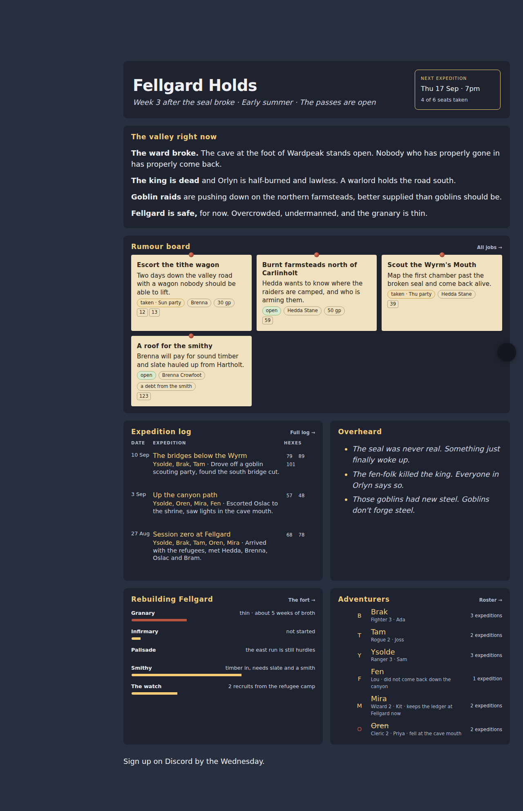
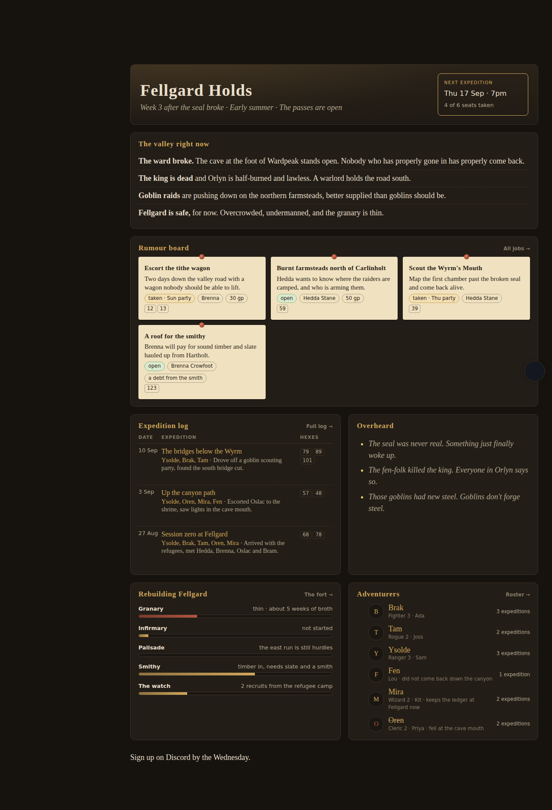

# Campaign Hub

A [Digital Garden](https://github.com/oleeskild/digitalgarden) plugin that
turns a garden into the hub for a West Marches tabletop campaign.

Jobs, expedition reports, characters and rebuild projects are ordinary
Obsidian notes with a couple of properties on them. The plugin reads those
properties and builds a home dashboard and four index pages, so the site
stays current by publishing notes rather than by editing any page by hand.

Built for [dunvale.forestry.md](https://dunvale.forestry.md) and its sibling
plugin [hexcrawl-map](https://github.com/j-a-hill/forestry-hexmap), which the
map card reads when it is installed. Everything works without it.



## Installing

Obsidian → Settings → Digital Garden → Plugins → Manage plugins → Install from
GitHub, and paste this repository's URL. Open the same screen later to update
when the version number changes.

## What it builds

**The home dashboard**, on the note tagged `gardenEntry`, when that note has
`hub: home`:

- a banner with the title, the in-world date and the next session
- *The valley right now* — the headlines you wrote on the home note
- a map card, filled in from the hexcrawl-map plugin's data
- the rumour board — open and taken jobs, newest first
- the expedition log — the most recent sessions, with hexes linked into the map
- *Overheard* — your rumours, three at random on each visit
- the rebuild tracker, and the roster with expedition counts

Any section with nothing to show is left out entirely.

**Four index pages**, each an ordinary note you can write an intro on:
`hub: jobs`, `hub: log`, `hub: roster` and `hub: fort`.

**A property strip** under the title of every job, session and character note.

## The notes

Every property is optional unless it says otherwise. A note with an unexpected
value is left out of the hub rather than breaking the build.

### A job

```yaml
type: job            # required
status: open         # open | taken | done | failed (default open)
patron: "[[Hedda Stane]]"
reward: 50 gp        # free text
hex: 59              # a number, a list, or "59, 60"
taken-by: Thu party
posted: 2026-09-10   # sorts the board, newest first
summary: Hedda wants to know where the raiders are camped.
```

### An expedition report

```yaml
type: session        # required
date: 2026-09-10
party: [Ysolde, Brak, Tam]
hexes: [79, 89, 101]
summary: Drove off a goblin scouting party, found the south bridge cut.
```

### A character

```yaml
type: character      # required
player: Sam
class: Ranger
level: 3
origin: Holtwyn
status: alive        # alive | missing | retired | dead (default alive)
fate: fell at the cave mouth   # shown when the status is not alive
```

Expedition counts are worked out from the session notes whose `party`
includes the character, so there is no count to keep up to date.

### A rebuild project

```yaml
type: facility       # required
progress: 60         # 0–100
state: timber in, needs slate and a smith
warn: false          # true turns the bar red
```

### The home note

```yaml
hub: home
world-date: Week 3 after the seal broke · Early summer
next-session: 2026-09-17 19:00
seats: 6
signed-up: 4
headlines:
  - "**The ward broke.** The cave at the foot of Wardpeak stands open."
rumours:
  - The seal was never real.
```

`headlines` and `rumours` take `**bold**`, `*italic*` and `` `code` ``.
Nothing else — they are one-line properties, not markdown documents.

### An index page

```yaml
hub: jobs     # or log, roster, fort
```

A property that holds a link (`patron`, `party`, `origin`) can be a wikilink
or plain text. A wikilink to a note you have not published renders as plain
text, never as a dead link.

## Settings

Obsidian → Settings → Digital Garden → Plugins → Campaign Hub.

| Setting | Default | What it does |
|---|---|---|
| Jobs on the rumour board | 4 | How many open or taken jobs the home page pins up |
| Expeditions on the home page | 3 | How many recent sessions the home page lists |
| Overheard rumours | random 3 | Three at random on each visit, or all of them |
| Hex map data | `/hexcrawl-map.json` | Where the map card reads its data |
| Property strip on notes | on | The strip under the title of job, session and character notes |
| Campaign theme | off | Restyles the whole site: parchment palette, Cinzel and EB Garamond |

The campaign theme is the only thing here that reaches outside your site: it
loads two typefaces from Google Fonts. Leave it off and the hub uses your
garden's own theme.



## Working on it

```
dev/setup.sh          clone the garden template into .garden/ and wire this in
dev/setup.sh --hexmap the same, plus the hexcrawl-map plugin, to test the map card
dev/build.sh          build, and fail on any [plugins] warning
dev/build.sh --off    build with the plugin disabled, to prove the site is unchanged
node dev/shot.mjs     screenshot every page at 1280 px and 400 px
node --test dev/tests/data.test.js
```

`dev/fixtures/notes/` holds a fake campaign in the shape the Obsidian
publisher actually writes — JSON frontmatter with user properties nested under
`dg-note-properties` — including the awkward cases: missing properties, a hex
list typed as a string, a session with no date, an unpublished wikilink target
and a hidden note.

The plugin is copied rather than symlinked into the test garden on purpose:
the loader lists `src/plugins` with `withFileTypes` and keeps only entries
where `isDirectory()` is true, which is false for a symlink, so a symlinked
plugin is never discovered.
